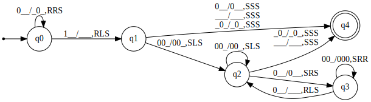
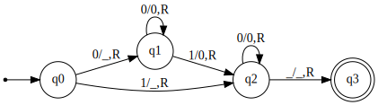
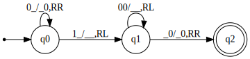

Turing Machine
--------------

This project provides a generic turing machine with N-Tapes. Currently there
are 3 concrete turing machines implemented, you can read more below.

### Diagram

Multiplication Machine, modeled using 3 tapes:



Sum Machine, modeled using 1 tape:



Subtraction Machine, modeled using 2 tapes:



### Usage

```sh
$ tm
    # interactive mode
```

Generate dot files from the turing machines:

```sh
$ tm_dots <out-directory>
```

### Compiling

To compile the project you need `cmake` and a C++ compiler. Currently
windows and linux are supported for building. (No additional libraries needed)

```sh
$ git clone https://github.com/realmar/turing-machine-cpp.git
$ cd turing-machine-cpp
# add -DCMAKE_BUILD_TYPE=Release for release build on linux
$ cmake CMakeLists.txt

# Linux
$ make

# Windows (Release Build)
$ msbuild turing-machine.sln /property:Configuration=Release
```

Then the binaries can be found here:

```sh
bin/tm(.exe)
bin/tm_dots(.exe)
```

### Output

```sh
$ tm
    # select multiplication
    # enter 2 * 3
    # select show all steps
    # select execute to finish

initial state:
tape 0: |q0|001000_ -> |q?|001000_
tape 1: |q0|_ -> |q?|_
tape 2: |q0|_ -> |q?|_
transition: <q0> -> <?>
execution result: not finished

all operations:
tape 0: |q0|001000_ -> _|q0|01000_
tape 1: |q0|_ -> 0|q0|_
tape 2: |q0|_ -> |q0|_
transition: <q0> -> <q0>
execution result: not finished
--
tape 0: _|q0|01000_ -> __|q0|1000_
tape 1: 0|q0|_ -> 00|q0|_
tape 2: |q0|_ -> |q0|_
transition: <q0> -> <q0>
execution result: not finished
--
tape 0: __|q0|1000_ -> ___|q1|000_
tape 1: 00|q0|_ -> 0|q1|0_
tape 2: |q0|_ -> |q1|_
transition: <q0> -> <q1>
execution result: not finished
--
tape 0: ___|q1|000_ -> ___|q2|000_
tape 1: 0|q1|0_ -> |q2|00_
tape 2: |q1|_ -> |q2|_
transition: <q1> -> <q2>
execution result: not finished
--
tape 0: ___|q2|000_ -> ___|q2|000_
tape 1: |q2|00_ -> |q2|_00_
tape 2: |q2|_ -> |q2|_
transition: <q2> -> <q2>
execution result: not finished
--
tape 0: ___|q2|000_ -> ___|q3|000_
tape 1: |q2|_00_ -> _|q3|00_
tape 2: |q2|_ -> |q3|_
transition: <q2> -> <q3>
execution result: not finished
--
tape 0: ___|q3|000_ -> ___|q3|000_
tape 1: _|q3|00_ -> _0|q3|0_
tape 2: |q3|_ -> 0|q3|_
transition: <q3> -> <q3>
execution result: not finished
--
tape 0: ___|q3|000_ -> ___|q3|000_
tape 1: _0|q3|0_ -> _00|q3|_
tape 2: 0|q3|_ -> 00|q3|_
transition: <q3> -> <q3>
execution result: not finished
--
tape 0: ___|q3|000_ -> ____|q2|00_
tape 1: _00|q3|_ -> _0|q2|0_
tape 2: 00|q3|_ -> 00|q2|_
transition: <q3> -> <q2>
execution result: not finished
--
tape 0: ____|q2|00_ -> ____|q2|00_
tape 1: _0|q2|0_ -> _|q2|00_
tape 2: 00|q2|_ -> 00|q2|_
transition: <q2> -> <q2>
execution result: not finished
--
tape 0: ____|q2|00_ -> ____|q2|00_
tape 1: _|q2|00_ -> |q2|_00_
tape 2: 00|q2|_ -> 00|q2|_
transition: <q2> -> <q2>
execution result: not finished
--
tape 0: ____|q2|00_ -> ____|q3|00_
tape 1: |q2|_00_ -> _|q3|00_
tape 2: 00|q2|_ -> 00|q3|_
transition: <q2> -> <q3>
execution result: not finished
--
tape 0: ____|q3|00_ -> ____|q3|00_
tape 1: _|q3|00_ -> _0|q3|0_
tape 2: 00|q3|_ -> 000|q3|_
transition: <q3> -> <q3>
execution result: not finished
--
tape 0: ____|q3|00_ -> ____|q3|00_
tape 1: _0|q3|0_ -> _00|q3|_
tape 2: 000|q3|_ -> 0000|q3|_
transition: <q3> -> <q3>
execution result: not finished
--
tape 0: ____|q3|00_ -> _____|q2|0_
tape 1: _00|q3|_ -> _0|q2|0_
tape 2: 0000|q3|_ -> 0000|q2|_
transition: <q3> -> <q2>
execution result: not finished
--
tape 0: _____|q2|0_ -> _____|q2|0_
tape 1: _0|q2|0_ -> _|q2|00_
tape 2: 0000|q2|_ -> 0000|q2|_
transition: <q2> -> <q2>
execution result: not finished
--
tape 0: _____|q2|0_ -> _____|q2|0_
tape 1: _|q2|00_ -> |q2|_00_
tape 2: 0000|q2|_ -> 0000|q2|_
transition: <q2> -> <q2>
execution result: not finished
--
tape 0: _____|q2|0_ -> _____|q3|0_
tape 1: |q2|_00_ -> _|q3|00_
tape 2: 0000|q2|_ -> 0000|q3|_
transition: <q2> -> <q3>
execution result: not finished
--
tape 0: _____|q3|0_ -> _____|q3|0_
tape 1: _|q3|00_ -> _0|q3|0_
tape 2: 0000|q3|_ -> 00000|q3|_
transition: <q3> -> <q3>
execution result: not finished
--
tape 0: _____|q3|0_ -> _____|q3|0_
tape 1: _0|q3|0_ -> _00|q3|_
tape 2: 00000|q3|_ -> 000000|q3|_
transition: <q3> -> <q3>
execution result: not finished
--
tape 0: _____|q3|0_ -> ______|q2|_
tape 1: _00|q3|_ -> _0|q2|0_
tape 2: 000000|q3|_ -> 000000|q2|_
transition: <q3> -> <q2>
execution result: not finished
--
tape 0: ______|q2|_ -> ______|q4|_
tape 1: _0|q2|0_ -> _0|q4|0_
tape 2: 000000|q2|_ -> 000000|q4|_
transition: <q2> -> <q4>
execution result: not finished
--
tape 0: ______|q4|_ -> ______|q4|_
tape 1: _0|q4|0_ -> _0|q4|0_
tape 2: 000000|q4|_ -> 000000|q4|_
transition: <q4> -> <q4>
execution result: finished
--

transitions: q0 -> q0 -> q0 -> q1 -> q2 -> q2 -> q3 -> q3 -> q3 -> q2 -> q2 -> q2 -> q3 -> q3 -> q3 -> q2 -> q2 -> q2 -> q3 -> q3 -> q3 -> q2 -> q4 -> q4

performed steps: 22

tape contents:
 tape 0:
 tape 1: 00 | 0 : 2 |
 tape 2: 000000 | 0 : 6 |
```

### Efficiency

Measured on an Intel i7-3920K @ 3.20 GHZ with Linux ubuntu-artful 4.13.0-38-generic,
g++ (Ubuntu 7.2.0-8ubuntu3.2) 7.2.0 in Release configuration (`-DCMAKE_BUILD_TYPE=Release`).

#### Multiplication Machine

```
2 * 3
    steps: 22 steps
    time:  0ms
```

```
100 * 100
    steps: 20'302
    time:  1'215ms / 1s
```

```
1000 * 100
    steps: 201'202
    time:  218'659ms / 218s
```

#### Sum Machine

```
2 + 3
    steps: 7
    time:  0ms
```

```
100 + 100
    steps: 202
    time:  0ms
```

```
1'000 + 100
    steps: 1'102
    time:  8ms
```

```
10'000 + 10'000
    steps: 20'002
    time:  6'068ms / 6s
```

#### Subtraction Machine

```
3 - 2
    steps: 7
    time:  0ms
```

```
100 - 99
    steps: 201
    time:  0ms
```

```
10'000 - 9'999
    steps: 20'001
    time:  7'627ms / 7s
```